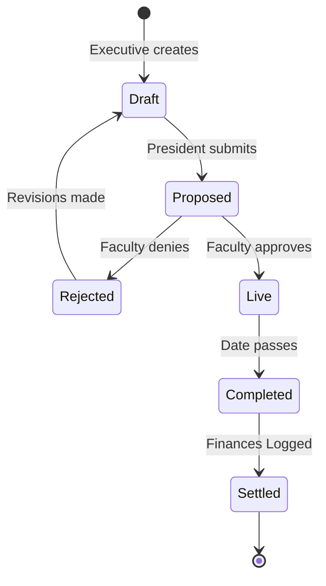

# ClubSync System & Process Architecture

This document defines the technical architecture, data models, and state machines required to power the 7 core processes of the ClubSync platform.

## 1. High-Level System Architecture

ClubSync operates on a unified backend serving two distinct frontends, mediated by strict Role-Based Access Control (RBAC).

```mermaid
graph TD
    subgraph Mobile App [Student App - React Native / Expo]
        SA[Student UI]
        GK[Gatekeeper UI / QR Scanner]
    end

    subgraph Backend [Supabase]
        Auth[GoTrue Auth]
        DB[(PostgreSQL)]
        Storage[Blob Storage]
        RLS{Row Level Security}
    end

    subgraph Web App [Management Desk - React / Vite]
        PD[President Dashboard]
        SD[Secretary Dashboard]
        ED[Executive Dashboard]
        FA[Faculty Approvals]
    end

    SA -->|Read Events, Write Registrations| RLS
    GK -->|Read Tickets, Write Scans| RLS
    PD -->|Manage Ledger, Approvals| RLS
    SD -->|Write Page Blocks, Upload Media| RLS
    ED -->|Write Tasks, Draft Events| RLS
    FA -->|Update Event Status| RLS

    RLS --> DB
    RLS --> Storage
    Mobile App <--> Auth
    Web App <--> Auth
```

---

## 2. Core Database Schema (The Data Layer)

To support all cycles, the PostgreSQL database requires the following core tables. JSONB columns are used for flexible structures (like page blocks), while Enums are used for strict state machines.

*   **`users`**: `id`, `email`, `name`, `prn`, `college_id`, `avatar_url`
*   **`clubs`**: `id`, `name`, `budget_limit`, `is_hiring` (boolean), `page_blocks` (JSONB)
*   **`memberships`**: `user_id`, `club_id`, `role` (Enum: `president`, `secretary`, `executive`, `member`, `faculty`)
*   **`events`**: `id`, `club_id`, `title`, `date`, `venue`, `budget_req`, `status` (Enum)
*   **`event_registrations`**: `id`, `user_id`, `event_id`, `status` (Enum: `registered`, `attended`)
*   **`tasks`**: `id`, `club_id`, `assignee_id`, `title`, `status` (Enum), `priority`
*   **`transactions`**: `id`, `club_id`, `type` (Enum: `in`, `out`), `amount`, `desc`, `logged_by`
*   **`recruitments`**: `id`, `club_id`, `user_id`, `status` (Enum)
*   **`announcements`**: `id`, `club_id`, `title`, `body`, `target_audience`, `read_receipts` (Array)
*   **`media`**: `id`, `club_id`, `file_url`, `file_type`, `uploaded_by`

---

## 3. Process Architectures & State Machines

### A. The Core Event Lifecycle
**Architecture Type:** Finite State Machine (FSM)
**Primary Table:** `events`
**Actors:** Executive (Drafts) ➔ President (Reviews) ➔ Faculty (Approves) ➔ Students (Registers) ➔ Gatekeeper (Scans)



### B. The Recruitment Cycle
**Architecture Type:** Kanban / Linear Pipeline
**Primary Table:** `recruitments`
**Actors:** Student (Applies) ➔ President/Exec (Manages Pipeline)

*   **Trigger:** `clubs.is_hiring` is set to `true`. Mobile app UI updates to show hiring badges.
*   **Data Flow:**
    1. Student submits application ➔ Row created in `recruitments` (`status: applied`).
    2. Web Dashboard maps rows into Kanban columns based on `status`.
    3. Dragging a card triggers an `UPDATE recruitments SET status = 'new_status'` API call.
    4. When moved to `onboarded`, a PostgreSQL Trigger fires: `INSERT INTO memberships (user_id, club_id, role)` to automatically grant dashboard access.

### C. Registration & Onboarding Cycle
**Architecture Type:** Trigger-based Auth Flow
**Primary Tables:** `auth.users` (Supabase internal) ➔ `public.users`

1.  **Auth Layer:** User authenticates via Google OAuth or Email/Password on the mobile app.
2.  **Trigger Layer:** PostgreSQL trigger `on_auth_user_created` automatically inserts a row into `public.users` with default schema requirements.
3.  **Application Layer:** Mobile app checks if `public.users.college_id` or `prn` is null. If null, the app's routing blocks access to the main tabs and forces the Onboarding Screen (Passport Setup).

### D. Content & PR Publishing Cycle
**Architecture Type:** Document Store (JSONB) + Blob Storage
**Primary Tables:** `clubs` (`page_blocks` column), `media`
**Actors:** Secretary

*   **Media Storage:** Secretary uploads to Supabase Storage bucket (`club-assets`). Supabase returns a public URL, which is saved in the `media` table.
*   **Page Editor:** The club's profile page is stored as a JSONB array in the `clubs.page_blocks` column. This prevents needing 10 different tables for different page sections.
    ```json
    [
      { "type": "about", "content": "GedIT is..." },
      { "type": "gallery", "images": ["url1", "url2"] }
    ]
    ```
*   Saving a draft saves to local state or a temporary `draft_blocks` column. "Publishing" overwrites the live `page_blocks` JSONB object, which instantly updates the mobile app's Club Screen via Supabase realtime.

### E. Operational Task Management
**Architecture Type:** Relational Kanban
**Primary Table:** `tasks`
**Actors:** Executive

*   Similar to Recruitment, this relies on Enum state columns (`backlog`, `todo`, `in_progress`, `review`, `done`).
*   **Relations:** `tasks.assignee_id` joins to `users.id` to fetch avatars and names on the Kanban cards.
*   **Realtime Synchronization:** The Web dashboard subscribes to Supabase Realtime on the `tasks` table. When one executive moves a card, it moves on everyone else's screen instantly without a refresh.

### F. Financial (Ledger) Cycle
**Architecture Type:** Append-Only Ledger (Event Sourcing lite)
**Primary Table:** `transactions`, `clubs` (`budget_limit`)
**Actors:** President

*   **Rule:** Transactions are *append-only*. To correct a mistake, a reversing transaction must be logged.
*   **Calculation:** The dashboard computes current balance dynamically: 
    `Balance = budget_limit + SUM(amount WHERE type='in') - SUM(amount WHERE type='out')`.
*   **Security:** RLS policies restrict `INSERT` access on the `transactions` table strictly to users holding the `president` role in the `memberships` table for that specific `club_id`.

### G. Announcements & Communication Cycle
**Architecture Type:** Pub/Sub & Push Notifications
**Primary Table:** `announcements`
**Actors:** Executive / President

1.  **Creation:** Announcement row is created with `target_audience` (e.g., 'all_members').
2.  **Dispatch (Edge Function):** A Supabase Database Webhook listens for `INSERT` on `announcements`. It triggers a serverless Edge Function.
3.  **Push:** The Edge Function queries `memberships` to find Expo Push Tokens for the targeted users and hits the Expo Push Notification API.
4.  **Read Receipts:** When a user opens the mobile app notification, a quick RPC call appends their `user_id` to the `read_receipts` array on the announcement row, updating the "Open Rate" metrics on the Executive dashboard.
