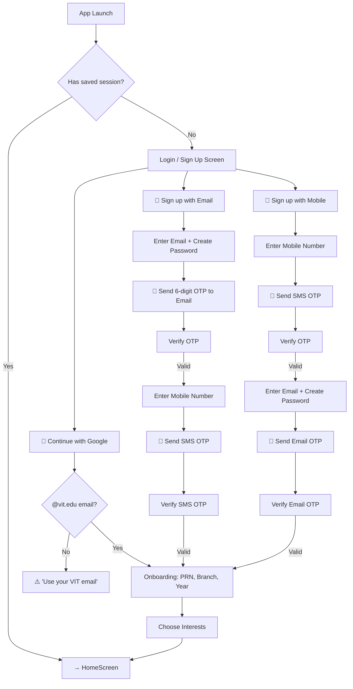
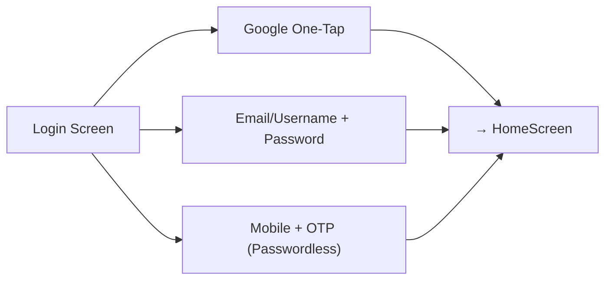
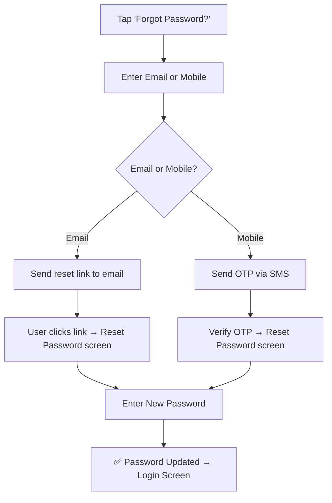

# ClubSync — Authentication Flow Design (V1)

## Philosophy
Offer **3 ways to get in**, verify **2 things** (email + phone), and make returning users feel instant.

---

## Auth Methods (Inspired by LeetCode + Unstop)

| Method | Sign Up | Sign In | Why Include It |
|--------|---------|---------|----------------|
| **Google OAuth** | ✅ One-tap | ✅ One-tap | Fastest. 80%+ of college students use Gmail. |
| **Email + Password** | ✅ With OTP verification | ✅ Standard | For students who prefer manual accounts. |
| **Mobile + OTP** | ✅ With SMS OTP | ✅ Passwordless | India-first. WhatsApp/SMS is king. No password to forget. |

---

## Flow 1: First-Time Sign Up (New User)



> [!IMPORTANT]
> Both email AND mobile must be verified before account creation is complete. This ensures every user has two verified contact methods for gate passes, event notifications, and password recovery.

---

## Flow 2: Returning User Sign In



Returning users should **never** see the onboarding screen again. The app checks the database, finds their profile, and drops them straight into the Home tab.

---

## Screen-by-Screen Breakdown

### Screen 1: Welcome / Login Screen
```
┌──────────────────────────────┐
│        [CS Logo]             │
│       ClubSync VIT           │
│                              │
│  ┌──────────────────────┐    │
│  │ 🔵 Continue with Google │    │
│  └──────────────────────┘    │
│                              │
│  ────── or sign in with ──── │
│                              │
│  ┌──────────────────────┐    │
│  │ Email / Username / Mobile │
│  └──────────────────────┘    │
│  ┌──────────────────────┐    │
│  │ Password              │    │
│  └──────────────────────┘    │
│                              │
│  [Sign In]                   │
│                              │
│  Forgot Password?   Sign Up  │
│                              │
│  By continuing, you agree to │
│  Terms & Privacy Policy      │
└──────────────────────────────┘
```

> [!TIP]
> The single input field accepts **email, username, OR mobile number**. The backend auto-detects the format:
> - Contains `@` → treat as email
> - All digits (10 chars) → treat as mobile
> - Otherwise → treat as username

---

### Screen 2: Sign Up Form
```
┌──────────────────────────────┐
│  ← Back                     │
│                              │
│  Create your account         │
│                              │
│  ┌──────────────────────┐    │
│  │ Full Name             │    │
│  └──────────────────────┘    │
│  ┌──────────────────────┐    │
│  │ Email Address         │    │
│  └──────────────────────┘    │
│  ┌──────────────────────┐    │
│  │ Mobile Number (+91)   │    │
│  └──────────────────────┘    │
│  ┌──────────────────────┐    │
│  │ Create Username       │    │
│  └──────────────────────┘    │
│  ┌──────────────────────┐    │
│  │ Create Password       │    │
│  └──────────────────────┘    │
│                              │
│  [Continue →]                │
└──────────────────────────────┘
```

After clicking "Continue", the app sends OTPs to **both** the email and mobile number for dual verification.

---

### Screen 3: OTP Verification (Dual)
```
┌──────────────────────────────┐
│  Verify your identity        │
│                              │
│  📩 Email OTP sent to        │
│     pra***@vit.edu           │
│  ┌──┐ ┌──┐ ┌──┐ ┌──┐ ┌──┐ ┌──┐│
│  │  │ │  │ │  │ │  │ │  │ │  ││
│  └──┘ └──┘ └──┘ └──┘ └──┘ └──┘│
│  ✅ Email Verified            │
│                              │
│  📲 SMS OTP sent to          │
│     +91 98***XXX67           │
│  ┌──┐ ┌──┐ ┌──┐ ┌──┐ ┌──┐ ┌──┐│
│  │  │ │  │ │  │ │  │ │  │ │  ││
│  └──┘ └──┘ └──┘ └──┘ └──┘ └──┘│
│                              │
│  Resend OTP (00:28)          │
│                              │
│  [Verify & Create Account]   │
└──────────────────────────────┘
```

---

### Screen 4: Student Onboarding (After Verification)
Same as our current Step 2 — PRN, Branch, Year, Interests. This only appears once.

---

## Password Policy (Industry Standard)

| Rule | Requirement |
|------|-------------|
| Min length | 8 characters |
| Must contain | 1 uppercase, 1 lowercase, 1 number |
| Optional | Special character (recommended) |
| Strength meter | Visual bar (Weak → Strong) |

---

## Forgot Password Flow



---

## Session & Security

| Feature | Implementation |
|---------|---------------|
| **Session Token** | JWT stored in secure device storage (not AsyncStorage) |
| **Auto-login** | App checks for valid token on launch. If valid → skip login. |
| **Token Expiry** | 30 days. After that, user must re-authenticate. |
| **Logout** | Clears token + navigates to login screen. |
| **Bot Protection** | Cloudflare Turnstile or reCAPTCHA on the sign-up form (like LeetCode). |
| **Rate Limiting** | Max 5 OTP requests per phone/email per hour. |

---

## My Recommendations

> [!TIP]
> **For V1 launch at VIT, start with just 2 methods:**
> 1. ✅ Google OAuth (fastest, lowest friction)
> 2. ✅ Mobile + OTP (passwordless, India-friendly)
> 
> Add Email+Password in V1.1 after you have real users. It adds complexity (forgot password flow, password hashing, strength validation) without much benefit when Google and OTP cover 95% of users.

> [!NOTE]
> **Username is optional for V1.** Students can set one later in Profile settings. This reduces friction during sign-up. Unstop and LinkedIn both allow profile setup after account creation.
