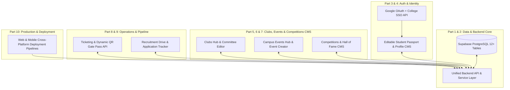

# ClubSync End-to-End Master Implementation Plan: 10-Part Database, API, Backend & Editing Architecture

This plan establishes the complete 10-part architectural roadmap to connect the entire ClubSync project (Backend, UI, APIs, PostgreSQL/Supabase Database, Google OAuth, and Deployment) and enable **full editing capabilities for all user and club information** across the platform.

---

## User Review Required

> [!IMPORTANT]
> **10-Part Structured Architecture**: All backend services, APIs, database tables, and UI editing capabilities are divided into **10 modular parts** as requested.
> 
> **Full Information Editing**: Every core module (User Profile, Club Data, Campus Events, Competitions, Ticketing, and Recruitment Applications) will support live creation and editing with real-time sync to the PostgreSQL database and instant reactive UI updates.
> 
> **Authentication & API**: Supabase Auth + Google OAuth and Student College PRN/Email login will be wired with automatic token persistence and session restoration.

---

## 10-Part Master Roadmap & Architecture Overview

---

## The 10 Parts in Detail

### Part 1: Supabase Database Schema & Multi-Tenant Relational Foundation
* **Scope & Objectives**:
  - Full relational schema in PostgreSQL for nationwide colleges, clubs, events, competitions, teams, winners, tickets, registrations, applications, and financial transactions.
  - Multi-college tenancy (`colleges` table) covering IITs, NITs, BITS, VIT, COEP, PICT, and all Indian universities.
  - Row Level Security (RLS) policies allowing public read, student self-management, and club committee admin privileges.
  - Analytical database views for real-time aggregation (`v_college_winner_leaderboard`, `v_inter_college_participation_stats`, `v_club_annual_performance`).
* **Key Files**:
  - [`database/schema.sql`](file:///c:/Users/prana/OneDrive/Desktop/Clubsync/database/schema.sql) (Complete PostgreSQL migration script)
  - [`database/README.md`](file:///c:/Users/prana/OneDrive/Desktop/Clubsync/database/README.md) (One-click cloud setup & SQL execution guide)

---

### Part 2: Unified Backend Client & Real-Time Supabase Service Layer
* **Scope & Objectives**:
  - Centralized API service layer with full TypeScript typing (`clubSyncService.ts`, `database.types.ts`).
  - Resilient hybrid data pipeline: connects directly to live Supabase database with seamless offline fallback cache when offline or in development.
  - Real-time Supabase subscriptions (WebSocket) for live RSVPs, ticket counts, and application status updates.
* **Key Files**:
  - [`mobile/src/lib/supabase.ts`](file:///c:/Users/prana/OneDrive/Desktop/Clubsync/mobile/src/lib/supabase.ts) (Configured Supabase client)
  - [`mobile/src/services/clubSyncService.ts`](file:///c:/Users/prana/OneDrive/Desktop/Clubsync/mobile/src/services/clubSyncService.ts) (Full CRUD services)
  - [`mobile/src/types/database.ts`](file:///c:/Users/prana/OneDrive/Desktop/Clubsync/mobile/src/types/database.ts) (TypeScript database definitions)

---

### Part 3: Authentication & OAuth Integration (Google Login + College SSO)
* **Scope & Objectives**:
  - Google OAuth Sign-In integration via Supabase Auth.
  - Direct College Email / Password Auth with domain detection (`@vit.edu`, `@coeptech.ac.in`, `@iitb.ac.in`, etc.).
  - Secure session storage (AsyncStorage / secure token persistence) preventing logout on app reload.
  - Automatic user bootstrap: first-time Google login creates/syncs a student profile in the database.
* **Key Files**:
  - [`mobile/src/services/authService.ts`](file:///c:/Users/prana/OneDrive/Desktop/Clubsync/mobile/src/services/authService.ts) (Google OAuth & Email Auth methods)
  - [`mobile/src/screens/OnboardingScreen.tsx`](file:///c:/Users/prana/OneDrive/Desktop/Clubsync/mobile/src/screens/OnboardingScreen.tsx) (Google Sign-In button + interactive auth flow)

---

### Part 4: Interactive Student Passport & Full Profile Editing Hub
* **Scope & Objectives**:
  - **Full Edit Mode for Student Profile**: Edit Full Name, Email, PRN/Roll No, College, Branch, Academic Year (FY/SY/TY/Final), CGPA, Bio, Skills, Phone, and Social links.
  - Immediate sync to Supabase `users` table + global session state update across all tabs.
  - Verification badge generator adapting to CGPA (≥ 7.0 for Core Committee eligibility).
  - Downloadable NAAC Co-Curricular Activity Transcript & Verified Certificates.
* **Key Files**:
  - [`mobile/src/screens/ProfileScreen.tsx`](file:///c:/Users/prana/OneDrive/Desktop/Clubsync/mobile/src/screens/ProfileScreen.tsx) (Dynamic profile card with "Edit Profile" modal)
  - [`mobile/src/services/clubSyncService.ts`](file:///c:/Users/prana/OneDrive/Desktop/Clubsync/mobile/src/services/clubSyncService.ts) (`updateUserProfile` API)

---

### Part 5: Clubs Management & Core Committee CMS (Full Club Edit & Follow API)
* **Scope & Objectives**:
  - **Full Edit Mode for Clubs**: Club Presidents and Faculty Mentors can edit Tagline, Vision, Mission, Faculty Mentor name/designation, Workshop/Lab location, WhatsApp group link, Instagram handle, Open Recruitment toggle, Recruitment Deadlines, Open Positions, and FAQs.
  - Real-time Follow/Unfollow API persisting subscriber count in the database.
  - Content Visibility switch (`public` vs `college-only`).
  - Search by vertical (Technical, Cultural, Sports, Social, Entrepreneurship) and instant keyword search.
* **Key Files**:
  - [`mobile/src/screens/ClubsScreen.tsx`](file:///c:/Users/prana/OneDrive/Desktop/Clubsync/mobile/src/screens/ClubsScreen.tsx) (Interactive club details modal with President/Faculty Edit CMS)
  - [`mobile/src/services/clubSyncService.ts`](file:///c:/Users/prana/OneDrive/Desktop/Clubsync/mobile/src/services/clubSyncService.ts) (`updateClubDetails`, `toggleFollowClub` APIs)

---

### Part 6: Campus Events & Event Creation/Editing API
* **Scope & Objectives**:
  - **Event Creator & Editor CMS**: Add new events or edit existing events (Title, Description, Event Type, Date & Time, Venue, Ticket Price, Capacity, Scope: Intra-College / Inter-Collegiate / National, Banner Image).
  - Multi-criteria sort (Nearest Date, Most Popular, Highest Prize, Free First) and vertical filter chips.
  - Event approval lifecycle (`DRAFT` ➔ `PROPOSED` ➔ `APPROVED` ➔ `LIVE`).
  - Live RSVP / Registration counter incrementing in real-time.
* **Key Files**:
  - [`mobile/src/screens/EventsScreen.tsx`](file:///c:/Users/prana/OneDrive/Desktop/Clubsync/mobile/src/screens/EventsScreen.tsx) (Events feed + "Create / Edit Event" modal for leads)
  - [`mobile/src/services/clubSyncService.ts`](file:///c:/Users/prana/OneDrive/Desktop/Clubsync/mobile/src/services/clubSyncService.ts) (`createEvent`, `updateEvent`, `deleteEvent` APIs)

---

### Part 7: National Competitions, Hackathons & Hall of Fame CMS
* **Scope & Objectives**:
  - Global Discovery Hub for Hackathons, Case Studies, Quizzes, CTFs, and National Fests.
  - **Competition Creator & Editor**: Organizers can post competitions, edit prize pools, team size constraints (Solo, 1-4 Members), deadlines, and problem statements.
  - **Hall of Fame & Winner Archive**: Publish podium winners (1st Place, Runner Up, Special Mention) with cryptographic Certificate Verification codes (`CERT-VIT-...`).
  - Team registration flow with teammate PRN validation.
* **Key Files**:
  - [`mobile/src/screens/CompetitionsScreen.tsx`](file:///c:/Users/prana/OneDrive/Desktop/Clubsync/mobile/src/screens/CompetitionsScreen.tsx) (Competition discovery, Team registration, Hall of Fame editor)
  - [`mobile/src/services/clubSyncService.ts`](file:///c:/Users/prana/OneDrive/Desktop/Clubsync/mobile/src/services/clubSyncService.ts) (`publishWinners`, `registerCompetitionTeam` APIs)

---

### Part 8: Digital Ticketing, Dynamic QR Pass Generator & Gate Check-in API
* **Scope & Objectives**:
  - Tiered ticketing engine (Free Passes, Early Bird, All-Access Hackathon Passes).
  - Dynamic QR Token generator (`CLUBSYNC-TKT-${eventId}-${prn}-${timestamp}`) with live high-contrast SVG QR Code rendering.
  - Gatekeeper Check-in API: QR scanner endpoint to validate tokens and update check-in status (`REGISTERED` ➔ `ATTENDED`) in Supabase `event_registrations`.
  - Pass wallet in Profile screen with instant view/download.
* **Key Files**:
  - [`mobile/src/screens/TicketsScreen.tsx`](file:///c:/Users/prana/OneDrive/Desktop/Clubsync/mobile/src/screens/TicketsScreen.tsx) & [`mobile/src/screens/ProfileScreen.tsx`](file:///c:/Users/prana/OneDrive/Desktop/Clubsync/mobile/src/screens/ProfileScreen.tsx)
  - [`mobile/src/services/clubSyncService.ts`](file:///c:/Users/prana/OneDrive/Desktop/Clubsync/mobile/src/services/clubSyncService.ts) (`registerForEvent`, `verifyGatePassToken` APIs)

---

### Part 9: Recruitment Pipeline & Application Review CMS
* **Scope & Objectives**:
  - Recruitment drive posting for clubs (eligible branches, academic years, minimum CGPA check).
  - Student application form (role selection, Statement of Purpose / SOP, portfolio/resume link).
  - **Committee Lead Candidate Review Hub**: Filter candidates by CGPA/Year, change status (`APPLIED` ➔ `SHORTLISTED` ➔ `INTERVIEW_SCHEDULED` ➔ `OFFERED` ➔ `REJECTED`), and log interview marks.
  - Live status notifications shown on the applicant's Home and Profile screens.
* **Key Files**:
  - [`mobile/src/screens/ClubsScreen.tsx`](file:///c:/Users/prana/OneDrive/Desktop/Clubsync/mobile/src/screens/ClubsScreen.tsx) (Recruitment tab & Application Review modal)
  - [`mobile/src/services/clubSyncService.ts`](file:///c:/Users/prana/OneDrive/Desktop/Clubsync/mobile/src/services/clubSyncService.ts) (`submitApplication`, `updateApplicationStatus` APIs)

---

### Part 10: Verification, Deployment Configuration & Cross-Platform Packaging
* **Scope & Objectives**:
  - **Web Deployment**: Standalone web build configuration and Vercel/Netlify hosting configuration (`vercel.json`, `web/index.html` sync).
  - **Mobile Packaging**: Expo configuration (`app.json`, `eas.json`) ready for Android APK generation and iOS builds.
  - Comprehensive TypeScript audit (`npx tsc --noEmit`) and integration test script verifying all 10 parts end-to-end.
  - Complete environment configuration (`.env.example`) and deployment guide.
* **Key Files**:
  - [`mobile/app.json`](file:///c:/Users/prana/OneDrive/Desktop/Clubsync/mobile/app.json) (Expo config)
  - [`vercel.json`](file:///c:/Users/prana/OneDrive/Desktop/Clubsync/vercel.json) (Web deployment configuration)
  - [`mobile/.env.example`](file:///c:/Users/prana/OneDrive/Desktop/Clubsync/mobile/.env.example) (Production environment template)

---

## Verification Plan

### Automated Verification:
- **TypeScript Typecheck**: Run `npx tsc --noEmit` inside `mobile/` to verify zero compile or type errors across all screens, services, and types.
- **Database & API Integration Script**: Create and run a verification script testing all CRUD operations (User update, Club update, Event create/edit, Registration, Competition winner publishing).

### Manual Verification Flow:
1. **Auth & Profile Editing**: Log in with Google/SSO ➔ Edit Student Name, PRN, CGPA, Branch ➔ Verify instant update in Passport and Supabase database.
2. **Club Editing**: Open a club ➔ Enable President Edit Mode ➔ Modify Tagline, Vision, WhatsApp link, and Recruitment status ➔ Verify persistent update.
3. **Event & Competition Management**: Create/Edit an event and a competition ➔ Verify it appears in the feed with proper category and ticket price.
4. **Ticketing & Gate Pass**: RSVP for an event ➔ Open Pass from Profile Hub ➔ Verify QR code generation and attendee details.
5. **Recruitment Flow**: Submit an application for a club role ➔ Switch to Committee view to shortlist the application ➔ Verify notification updates.
