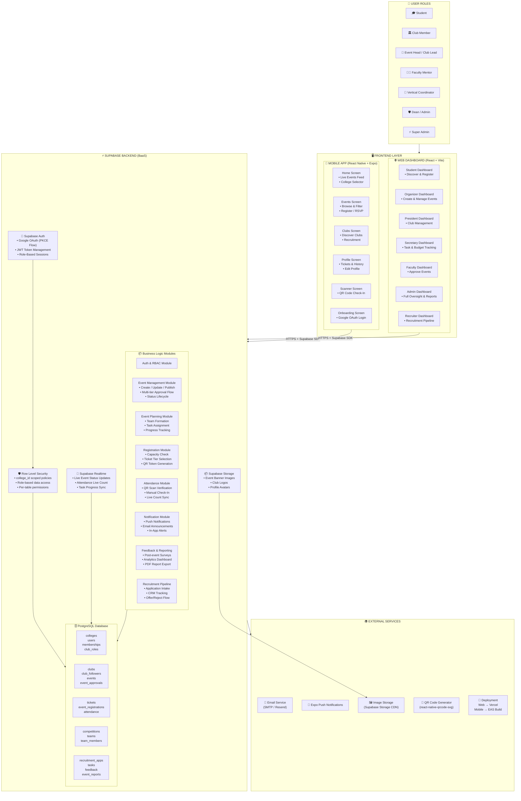
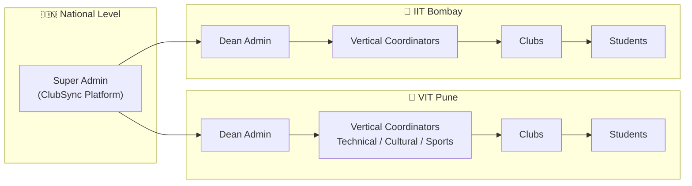

# ClubSync — Improved Event Cycle Flowchart & System Architecture

## Overview
This plan proposes a significantly enhanced version of the existing flowchart and system architecture diagram. The improvements are based on a full review of your actual codebase — including your **database schema** (multi-tier approvals, QR ticketing, recruitment pipeline), **mobile screens** (7 screens), **web pages** (8 role-based dashboards), and **Supabase backend services**.

The key improvements add:
- **Multi-tier approval chain** (Faculty → Resource In-charge → Vertical Coordinator → Dean Admin)
- **Actual roles from your DB** (STUDENT, CLUB_LEAD, FACULTY_MENTOR, VERTICAL_COORDINATOR, DEAN_ADMIN, SUPER_ADMIN)
- **Recruitment pipeline** as a separate parallel flow
- **Supabase-specific architecture** (RLS policies, Realtime, Auth, Storage, Edge Functions)
- **Multi-tenancy** (National colleges, college_id scoping)

---

## Proposed Change 1: Improved Event Cycle Flowchart

```mermaid
flowchart TD
    START([🚀 START]) --> PROPOSE

    subgraph PHASE1["📋 PHASE 1 — EVENT PROPOSAL"]
        PROPOSE["EVENT IDEA / PROPOSAL\n──────────────────\nClub member submits proposal\n• Event Name & Category\n• Estimated Budget\n• Expected Audience\n• Preferred Date & Venue"]
        PROPOSE --> CLUB_REVIEW["CLUB ADMIN / EVENT HEAD\nREVIEWS IDEA"]
        CLUB_REVIEW --> CLUB_APPROVED{"Approved\nby Club?"}
        CLUB_APPROVED -- NO --> MODIFY["MODIFY / REJECT\nFeedback given to proposer"]
        MODIFY --> PROPOSE
        CLUB_APPROVED -- YES --> FACULTY_REVIEW
    end

    subgraph PHASE2["✅ PHASE 2 — MULTI-TIER APPROVAL"]
        FACULTY_REVIEW["FACULTY MENTOR REVIEW\nLevel 1 Approval"]
        FACULTY_REVIEW --> FACULTY_OK{"Approved?"}
        FACULTY_OK -- NO --> REJECT1["REJECTED\nwith remarks"]
        FACULTY_OK -- YES --> RESOURCE_REVIEW
        RESOURCE_REVIEW["RESOURCE IN-CHARGE REVIEW\nLevel 2 Approval\n(Venue / Budget)"]
        RESOURCE_REVIEW --> RESOURCE_OK{"Approved?"}
        RESOURCE_OK -- NO --> REJECT2["CONDITIONAL /\nREJECTED"]
        RESOURCE_OK -- YES --> VERTICAL_REVIEW
        VERTICAL_REVIEW["VERTICAL COORDINATOR\nLevel 3 Approval"]
        VERTICAL_REVIEW --> VERTICAL_OK{"Approved?"}
        VERTICAL_OK -- NO --> REJECT3["REJECTED"]
        VERTICAL_OK -- YES --> DEAN_REVIEW
        DEAN_REVIEW["DEAN / ADMIN FINAL APPROVAL\nLevel 4 Approval"]
        DEAN_REVIEW --> DEAN_OK{"Final\nApproved?"}
        DEAN_OK -- NO --> REJECT4["REJECTED"]
        DEAN_OK -- YES --> EVENT_CREATE
    end

    subgraph PHASE3["🛠️ PHASE 3 — EVENT CREATION"]
        EVENT_CREATE["CREATE EVENT IN CLUBSYNC\n──────────────────\n• Event Name & Description\n• Category & Vertical\n• Date, Time & Duration\n• Venue / Online Platform\n• Capacity & Ticket Tiers\n• Registration Deadline\n• Banner Image\n• Prize Pool (if applicable)"]
        EVENT_CREATE --> TEAM_CREATE
        TEAM_CREATE["CREATE EVENT TEAM\n──────────────────\n• Event Head\n• Technical Team\n• Design Team\n• Marketing Team\n• Logistics Team\n• Volunteer Team"]
        TEAM_CREATE --> TASK_ASSIGN
        TASK_ASSIGN["ASSIGN TASKS & RESPONSIBILITIES\n──────────────────\nEach task:\n• Assigned Member\n• Deadline & Priority\n• Status: NOT STARTED → IN PROGRESS → DONE"]
        TASK_ASSIGN --> BUDGET
        BUDGET["BUDGET & RESOURCE PLANNING\n──────────────────\n• Estimated Budget\n• Equipment & Materials\n• Venue Requirements\n• Permissions\n• Sponsors"]
        BUDGET --> VENUE_CONFIRM
        VENUE_CONFIRM["VENUE / PLATFORM CONFIRMATION"]
        VENUE_CONFIRM --> READY_CHECK{"Ready to\nPublish?"}
        READY_CHECK -- NO --> PENDING["COMPLETE PENDING\nPREPARATION"]
        PENDING --> READY_CHECK
        READY_CHECK -- YES --> PUBLISH
    end

    subgraph PHASE4["📢 PHASE 4 — ANNOUNCEMENT & REGISTRATION"]
        PUBLISH["PUBLISH EVENT\nEvent visible to all students\nSTATUS: upcoming"]
        PUBLISH --> NOTIFY
        NOTIFY["NOTIFICATIONS SENT\n──────────────────\n• In-App Push Notification\n• Email Announcement\n• College-wide Broadcast"]
        NOTIFY --> STUDENT_VIEW
        STUDENT_VIEW["STUDENT VIEWS EVENT"]
        STUDENT_VIEW --> INTERESTED{"Interested?"}
        INTERESTED -- NO --> BROWSE_END(["END / Browse More"])
        INTERESTED -- YES --> REGISTER
        REGISTER["STUDENT REGISTERS\n──────────────────\n• Selects Ticket Tier\n• Fills Details\n• Confirms Capacity Check"]
        REGISTER --> REG_VALID{"Registration\nValid?"}
        REG_VALID -- NO --> REG_ERROR["SHOW ERROR /\nFull / Deadline Passed"]
        REG_ERROR --> REGISTER
        REG_VALID -- YES --> REG_CONFIRMED
        REG_CONFIRMED["PARTICIPANT REGISTERED\nSTATUS: REGISTERED\nQR Token Generated"]
        REG_CONFIRMED --> REG_CONFIRM_SENT["CONFIRMATION SENT\n• In-App Ticket\n• Email with QR Code"]
    end

    subgraph PHASE5["⚙️ PHASE 5 — PRE-EVENT PREPARATION"]
        TASK_MONITOR["TASK PROGRESS MONITORING\nNOT STARTED → IN PROGRESS → COMPLETED"]
        REMINDERS["SEND EVENT REMINDERS\n• To Organizers\n• To Volunteers\n• To Participants\n24hr & 1hr before event"]
        READINESS["FINAL READINESS CHECK\n✓ Venue Ready\n✓ Equipment Ready\n✓ Team Ready\n✓ Participants Confirmed"]
        EVENT_READY{"Event\nReady?"}
        FIX["FIX PENDING\nREQUIREMENTS"]
        TASK_MONITOR --> REMINDERS --> READINESS --> EVENT_READY
        EVENT_READY -- NO --> FIX --> READINESS
        EVENT_READY -- YES --> CHECKIN
    end

    subgraph PHASE6["🎯 PHASE 6 — EVENT DAY"]
        CHECKIN["PARTICIPANT CHECK-IN\n──────────────────\n• QR Code Scan (Mobile)\n• Manual Attendance\nSTATUS: ATTENDED"]
        CHECKIN --> EVENT_LIVE
        EVENT_LIVE["EVENT STARTED\nSTATUS: LIVE 🔴"]
        EVENT_LIVE --> EXECUTE
        EXECUTE["EVENT EXECUTION\n• Activities & Sessions\n• Competitions & Workshops\n• Live Announcements"]
        EXECUTE --> LIVE_MONITOR
        LIVE_MONITOR["LIVE MONITORING\n• Real-time Attendance\n• Schedule Tracking\n• Issue Handling"]
        LIVE_MONITOR --> EVENT_ENDS
        EVENT_ENDS(["EVENT ENDS"])
    end

    subgraph PHASE7["📊 PHASE 7 — POST-EVENT"]
        COMPLETE["MARK EVENT COMPLETED\nSTATUS: past"]
        FEEDBACK["COLLECT PARTICIPANT FEEDBACK\nRatings & Comments"]
        RESULTS["DECLARE RESULTS / WINNERS\nif applicable — Hall of Fame"]
        REPORT["GENERATE EVENT REPORT\n• Registrations & Attendance\n• Feedback Summary\n• Budget Summary\n• Event Outcome"]
        ARCHIVE["EVENT ARCHIVED\nHistory in ClubSync\nAvailable for future reference"]
        DONE(["🎉 EVENT CYCLE COMPLETE"])
        COMPLETE --> FEEDBACK --> RESULTS --> REPORT --> ARCHIVE --> DONE
    end

    REG_CONFIRM_SENT --> TASK_MONITOR
    EVENT_ENDS --> COMPLETE
```



---

## Proposed Change 2: Improved System Architecture



---

## Proposed Change 3: Multi-Tenancy Architecture



---

## Implementation Plan

### Phase A — Diagrams & Docs Update
Update the architecture documentation with the improved diagrams above.

| File | Action |
|------|--------|
| `Architectures/` folder | [MODIFY] Add improved Mermaid diagrams as `.md` files |
| `README.md` | [MODIFY] Embed updated architecture overview |
| `docs/` folder | [NEW] Add `EVENT_CYCLE_FLOW.md` and `SYSTEM_ARCHITECTURE.md` |

---

### Phase B — Missing Backend Features (Gap Analysis)

Based on your schema vs existing service code, these features exist in the DB but are **not yet wired up** in the frontend:

| Feature | DB Table Exists? | Mobile Wired? | Web Wired? | Priority |
|---------|-----------------|---------------|------------|----------|
| Multi-tier Event Approvals | ✅ `event_approvals` | ❌ | Partial | 🔴 High |
| Event Team Creation | ❌ Missing table | ❌ | ❌ | 🔴 High |
| Task Assignment & Tracking | ❌ Missing table | ❌ | Partial | 🔴 High |
| Budget Planning | ❌ Missing table | ❌ | ❌ | 🟡 Medium |
| Feedback Collection | ❌ Missing table | ❌ | ❌ | 🟡 Medium |
| Event Report Generation | ❌ Missing | ❌ | ❌ | 🟡 Medium |
| Live Event Monitoring | Partial | ❌ | ❌ | 🟡 Medium |
| Recruitment Pipeline | ✅ `recruitment_apps` | Partial | ✅ | 🟢 Done |
| QR Check-In | ✅ `event_registrations` | ✅ | ❌ | 🟢 Done |

---

### Phase C — Recommended New DB Tables

```sql
-- Event Teams
CREATE TABLE event_teams (...)

-- Event Tasks  
CREATE TABLE event_tasks (...)

-- Event Budget
CREATE TABLE event_budgets (...)

-- Event Feedback
CREATE TABLE event_feedback (...)
```

---

## Open Questions for You

> [!IMPORTANT]
> **Q1: Approval Chain** — Do you want ALL 4 levels of approval (Faculty → Resource → Vertical → Dean) or just a simplified 2-level flow (Club Admin → Dean)?

> [!IMPORTANT]
> **Q2: Event Teams & Tasks** — Should I add the missing DB tables for Event Teams and Task Assignment in the schema, and build the web UI for it?

> [!IMPORTANT]
> **Q3: Feedback Module** — Should the post-event feedback form appear in the mobile app, web, or both?

> [!NOTE]
> **Q4: Budget Module** — Should the budget planning be visible only to organizers/admins, or also shown to participants as a transparency feature?

---

## Verification Plan
- Render all Mermaid diagrams in GitHub to verify they display correctly
- Confirm all role labels match the actual `user_type` values in `users` table
- Run the web dashboard to verify RoleRouter routes match updated architecture
