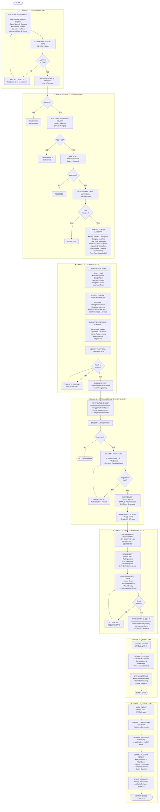

# ClubSync Event Cycle Flow

```mermaid
flowchart TD
    START([🚀 START]) --> PROPOSE

    subgraph PHASE1["📋 PHASE 1 — EVENT PROPOSAL"]
        PROPOSE["EVENT IDEA / PROPOSAL\n──────────────────\nClub member submits proposal\n• Event Name & Category\n• Estimated Budget\n• Expected Audience\n• Preferred Date & Venue"]
        PROPOSE --> CLUB_REVIEW["CLUB ADMIN / EVENT HEAD\nREVIEWS IDEA"]
        CLUB_REVIEW --> CLUB_APPROVED{"Approved\nby Club?"}
        CLUB_APPROVED -- NO --> MODIFY["MODIFY / REJECT\nFeedback given to proposer"]
        MODIFY --> PROPOSE
        CLUB_APPROVED -- YES --> FACULTY_REVIEW
    end

    subgraph PHASE2["✅ PHASE 2 — MULTI-TIER APPROVAL"]
        FACULTY_REVIEW["FACULTY MENTOR REVIEW\nLevel 1 Approval"]
        FACULTY_REVIEW --> FACULTY_OK{"Approved?"}
        FACULTY_OK -- NO --> REJECT1["REJECTED\nwith remarks"]
        FACULTY_OK -- YES --> RESOURCE_REVIEW
        RESOURCE_REVIEW["RESOURCE IN-CHARGE REVIEW\nLevel 2 Approval\n(Venue / Budget)"]
        RESOURCE_REVIEW --> RESOURCE_OK{"Approved?"}
        RESOURCE_OK -- NO --> REJECT2["CONDITIONAL /\nREJECTED"]
        RESOURCE_OK -- YES --> VERTICAL_REVIEW
        VERTICAL_REVIEW["VERTICAL COORDINATOR\nLevel 3 Approval"]
        VERTICAL_REVIEW --> VERTICAL_OK{"Approved?"}
        VERTICAL_OK -- NO --> REJECT3["REJECTED"]
        VERTICAL_OK -- YES --> DEAN_REVIEW
        DEAN_REVIEW["DEAN / ADMIN FINAL APPROVAL\nLevel 4 Approval"]
        DEAN_REVIEW --> DEAN_OK{"Final\nApproved?"}
        DEAN_OK -- NO --> REJECT4["REJECTED"]
        DEAN_OK -- YES --> EVENT_CREATE
    end

    subgraph PHASE3["🛠️ PHASE 3 — EVENT CREATION"]
        EVENT_CREATE["CREATE EVENT IN CLUBSYNC\n──────────────────\n• Event Name & Description\n• Category & Vertical\n• Date, Time & Duration\n• Venue / Online Platform\n• Capacity & Ticket Tiers\n• Registration Deadline\n• Banner Image\n• Prize Pool (if applicable)"]
        EVENT_CREATE --> TEAM_CREATE
        TEAM_CREATE["CREATE EVENT TEAM\n──────────────────\n• Event Head\n• Technical Team\n• Design Team\n• Marketing Team\n• Logistics Team\n• Volunteer Team"]
        TEAM_CREATE --> TASK_ASSIGN
        TASK_ASSIGN["ASSIGN TASKS & RESPONSIBILITIES\n──────────────────\nEach task:\n• Assigned Member\n• Deadline & Priority\n• Status: NOT STARTED → IN PROGRESS → DONE"]
        TASK_ASSIGN --> BUDGET
        BUDGET["BUDGET & RESOURCE PLANNING\n──────────────────\n• Estimated Budget\n• Equipment & Materials\n• Venue Requirements\n• Permissions\n• Sponsors"]
        BUDGET --> VENUE_CONFIRM
        VENUE_CONFIRM["VENUE / PLATFORM CONFIRMATION"]
        VENUE_CONFIRM --> READY_CHECK{"Ready to\nPublish?"}
        READY_CHECK -- NO --> PENDING["COMPLETE PENDING\nPREPARATION"]
        PENDING --> READY_CHECK
        READY_CHECK -- YES --> PUBLISH
    end

    subgraph PHASE4["📢 PHASE 4 — ANNOUNCEMENT & REGISTRATION"]
        PUBLISH["PUBLISH EVENT\nEvent visible to all students\nSTATUS: upcoming"]
        PUBLISH --> NOTIFY
        NOTIFY["NOTIFICATIONS SENT\n──────────────────\n• In-App Push Notification\n• Email Announcement\n• College-wide Broadcast"]
        NOTIFY --> STUDENT_VIEW
        STUDENT_VIEW["STUDENT VIEWS EVENT"]
        STUDENT_VIEW --> INTERESTED{"Interested?"}
        INTERESTED -- NO --> BROWSE_END(["END / Browse More"])
        INTERESTED -- YES --> REGISTER
        REGISTER["STUDENT REGISTERS\n──────────────────\n• Selects Ticket Tier\n• Fills Details\n• Confirms Capacity Check"]
        REGISTER --> REG_VALID{"Registration\nValid?"}
        REG_VALID -- NO --> REG_ERROR["SHOW ERROR /\nFull / Deadline Passed"]
        REG_ERROR --> REGISTER
        REG_VALID -- YES --> REG_CONFIRMED
        REG_CONFIRMED["PARTICIPANT REGISTERED\nSTATUS: REGISTERED\nQR Token Generated"]
        REG_CONFIRMED --> REG_CONFIRM_SENT["CONFIRMATION SENT\n• In-App Ticket\n• Email with QR Code"]
    end

    subgraph PHASE5["⚙️ PHASE 5 — PRE-EVENT PREPARATION"]
        TASK_MONITOR["TASK PROGRESS MONITORING\nNOT STARTED → IN PROGRESS → COMPLETED"]
        REMINDERS["SEND EVENT REMINDERS\n• To Organizers\n• To Volunteers\n• To Participants\n24hr & 1hr before event"]
        READINESS["FINAL READINESS CHECK\n✓ Venue Ready\n✓ Equipment Ready\n✓ Team Ready\n✓ Participants Confirmed"]
        EVENT_READY{"Event\nReady?"}
        FIX["FIX PENDING\nREQUIREMENTS"]
        TASK_MONITOR --> REMINDERS --> READINESS --> EVENT_READY
        EVENT_READY -- NO --> FIX --> READINESS
        EVENT_READY -- YES --> CHECKIN
    end

    subgraph PHASE6["🎯 PHASE 6 — EVENT DAY"]
        CHECKIN["PARTICIPANT CHECK-IN\n──────────────────\n• QR Code Scan (Mobile)\n• Manual Attendance\nSTATUS: ATTENDED"]
        CHECKIN --> EVENT_LIVE
        EVENT_LIVE["EVENT STARTED\nSTATUS: LIVE 🔴"]
        EVENT_LIVE --> EXECUTE
        EXECUTE["EVENT EXECUTION\n• Activities & Sessions\n• Competitions & Workshops\n• Live Announcements"]
        EXECUTE --> LIVE_MONITOR
        LIVE_MONITOR["LIVE MONITORING\n• Real-time Attendance\n• Schedule Tracking\n• Issue Handling"]
        LIVE_MONITOR --> EVENT_ENDS
        EVENT_ENDS(["EVENT ENDS"])
    end

    subgraph PHASE7["📊 PHASE 7 — POST-EVENT"]
        COMPLETE["MARK EVENT COMPLETED\nSTATUS: past"]
        FEEDBACK["COLLECT PARTICIPANT FEEDBACK\nRatings & Comments"]
        RESULTS["DECLARE RESULTS / WINNERS\nif applicable — Hall of Fame"]
        REPORT["GENERATE EVENT REPORT\n• Registrations & Attendance\n• Feedback Summary\n• Budget Summary\n• Event Outcome"]
        ARCHIVE["EVENT ARCHIVED\nHistory in ClubSync\nAvailable for future reference"]
        DONE(["🎉 EVENT CYCLE COMPLETE"])
        COMPLETE --> FEEDBACK --> RESULTS --> REPORT --> ARCHIVE --> DONE
    end

    REG_CONFIRM_SENT --> TASK_MONITOR
    EVENT_ENDS --> COMPLETE
```
