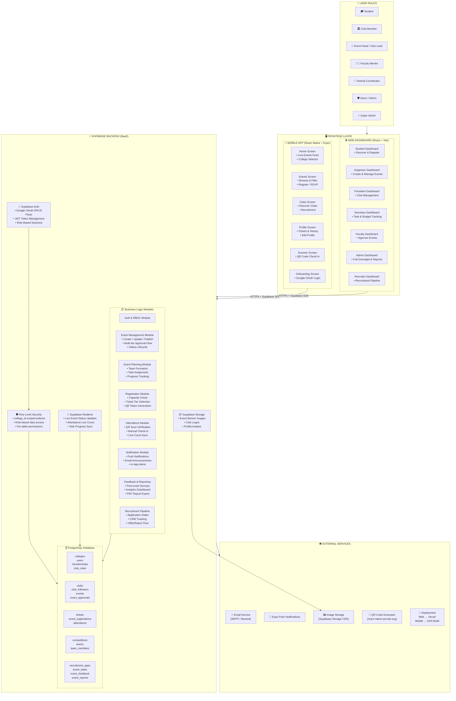
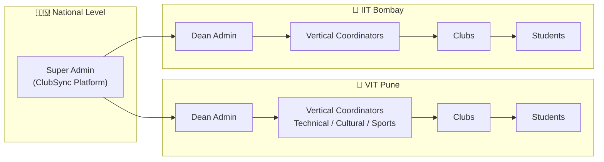

# ClubSync System Architecture

## Overall Architecture

```mermaid
graph TB
    subgraph USERS["👥 USER ROLES"]
        U1["🎓 Student"]
        U2["🏛️ Club Member"]
        U3["👑 Event Head / Club Lead"]
        U4["👨‍🏫 Faculty Mentor"]
        U5["🔑 Vertical Coordinator"]
        U6["🛡️ Dean / Admin"]
        U7["⚡ Super Admin"]
    end

    subgraph FRONTEND["🖥️ FRONTEND LAYER"]
        direction TB
        subgraph MOBILE["📱 MOBILE APP (React Native + Expo)"]
            M1["Home Screen\n• Live Events Feed\n• College Selector"]
            M2["Events Screen\n• Browse & Filter\n• Register / RSVP"]
            M3["Clubs Screen\n• Discover Clubs\n• Recruitment"]
            M4["Profile Screen\n• Tickets & History\n• Edit Profile"]
            M5["Scanner Screen\n• QR Code Check-In"]
            M6["Onboarding Screen\n• Google OAuth Login"]
        end
        subgraph WEB["🌐 WEB DASHBOARD (React + Vite)"]
            W1["Student Dashboard\n• Discover & Register"]
            W2["Organizer Dashboard\n• Create & Manage Events"]
            W3["President Dashboard\n• Club Management"]
            W4["Secretary Dashboard\n• Task & Budget Tracking"]
            W5["Faculty Dashboard\n• Approve Events"]
            W6["Admin Dashboard\n• Full Oversight & Reports"]
            W7["Recruiter Dashboard\n• Recruitment Pipeline"]
        end
    end

    subgraph SUPABASE["⚡ SUPABASE BACKEND (BaaS)"]
        direction TB
        AUTH["🔐 Supabase Auth\n• Google OAuth (PKCE Flow)\n• JWT Token Management\n• Role-Based Sessions"]
        REALTIME["🔴 Supabase Realtime\n• Live Event Status Updates\n• Attendance Live Count\n• Task Progress Sync"]
        STORAGE["📦 Supabase Storage\n• Event Banner Images\n• Club Logos\n• Profile Avatars"]
        RLS["🛡️ Row Level Security\n• college_id scoped policies\n• Role-based data access\n• Per-table permissions"]
        subgraph DB["🗄️ PostgreSQL Database"]
            direction LR
            DB1["colleges\nusers\nmemberships\nclub_roles"]
            DB2["clubs\nclub_followers\nevents\nevent_approvals"]
            DB3["tickets\nevent_registrations\nattendance"]
            DB4["competitions\nteams\nteam_members"]
            DB5["recruitment_apps\nevent_tasks\nevent_feedback\nevent_reports"]
        end
        subgraph MODULES["📦 Business Logic Modules"]
            MOD1["Auth & RBAC Module"]
            MOD2["Event Management Module\n• Create / Update / Publish\n• Multi-tier Approval Flow\n• Status Lifecycle"]
            MOD3["Event Planning Module\n• Team Formation\n• Task Assignment\n• Progress Tracking"]
            MOD4["Registration Module\n• Capacity Check\n• Ticket Tier Selection\n• QR Token Generation"]
            MOD5["Attendance Module\n• QR Scan Verification\n• Manual Check-In\n• Live Count Sync"]
            MOD6["Notification Module\n• Push Notifications\n• Email Announcements\n• In-App Alerts"]
            MOD7["Feedback & Reporting\n• Post-event Surveys\n• Analytics Dashboard\n• PDF Report Export"]
            MOD8["Recruitment Pipeline\n• Application Intake\n• CRM Tracking\n• Offer/Reject Flow"]
        end
    end

    subgraph EXTERNAL["🌍 EXTERNAL SERVICES"]
        EXT1["📧 Email Service\n(SMTP / Resend)"]
        EXT2["🔔 Expo Push Notifications"]
        EXT3["🖼️ Image Storage\n(Supabase Storage CDN)"]
        EXT4["📱 QR Code Generator\n(react-native-qrcode-svg)"]
        EXT5["🚀 Deployment\nWeb → Vercel\nMobile → EAS Build"]
    end

    USERS --> FRONTEND
    MOBILE -->|HTTPS + Supabase SDK| SUPABASE
    WEB -->|HTTPS + Supabase SDK| SUPABASE
    AUTH --> RLS
    RLS --> DB
    REALTIME --> DB
    STORAGE --> EXT3
    MODULES --> DB
    SUPABASE --> EXTERNAL
```

## Multi-Tenancy Architecture

```mermaid
graph LR
    subgraph NATIONAL["🇮🇳 National Level"]
        SA["Super Admin\n(ClubSync Platform)"]
    end
    subgraph COLLEGE_A["🏫 VIT Pune"]
        DA1["Dean Admin"]
        VC1["Vertical Coordinators\nTechnical / Cultural / Sports"]
        C1["Clubs"]
        S1["Students"]
    end
    subgraph COLLEGE_B["🏫 IIT Bombay"]
        DA2["Dean Admin"]
        VC2["Vertical Coordinators"]
        C2["Clubs"]
        S2["Students"]
    end
    SA --> DA1
    SA --> DA2
    DA1 --> VC1 --> C1 --> S1
    DA2 --> VC2 --> C2 --> S2
```
