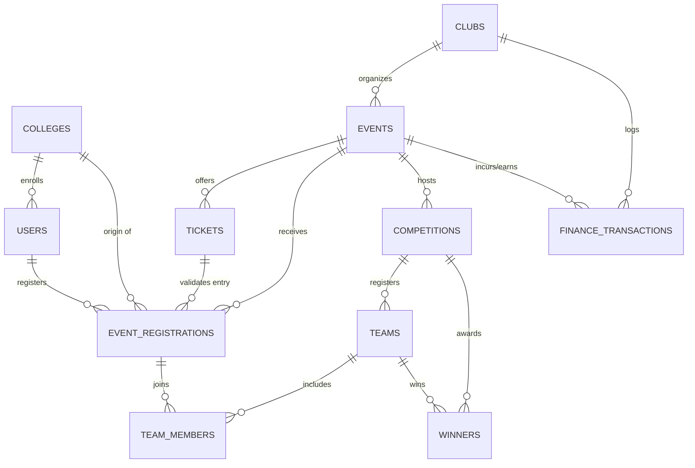

# Comprehensive Plan: ClubSync Event Data Archival, Ticketing & Analytics Engine

## Overview
This plan establishes the architecture and data model to support **Club Core Committees** in running their operations end-to-end (budgeting, event proposals, recruitment, publicity, ticketing) while automatically maintaining a **centralized, searchable multi-year archive (2+ years)**. This unlocks a powerful **Analytics & Conclusion Engine** to answer critical institutional questions:
- *Who attended which event?*
- *Who won each competition and track?*
- *Which external colleges participate the most and win the most trophies?*
- *What is the financial return and participation trend across academic years?*

---

## User Review Required

> [!IMPORTANT]
> **Data Scope & Privacy**: External college students will register using their student email, college name, branch, and contact details. Internal students will have their profile auto-linked via their college PRN/Student ID.
> 
> **Report Exports**: The analytics engine will support one-click exports formatted for:
> 1. **College Annual Club Review & Renewal Form (AY 2026–27 format)**
> 2. **NAAC / NBA Accreditation Audit Reports**
> 3. **Inter-College Trophy & Winner Leaderboards**

---

## 1. Extended Relational Data Architecture

To support deep querying, participant tracking, ticketing, and inter-college conclusions, we extend the core schema with dedicated entities:

### Core Entities & Attributes

#### 1. `COLLEGES` / `INSTITUTES`
* `college_id` (PK)
* `name` (e.g., *VIT Pune*, *COEP*, *PICT*, *MIT-WPU*, *VIIT*)
* `city`, `state`
* `type` (*Autonomous, Affiliated, Deemed, University*)

#### 2. `TICKETS` & `EVENT_REGISTRATIONS` (Ticketing & Footfall)
* `ticket_id` (PK), `event_id` (FK)
* `tier_name` (*Early Bird, Standard, VIP, Internal Student, External Team*)
* `price` (₹), `capacity`, `sold_count`
* `registration_id` (PK), `user_id` (FK), `ticket_id` (FK), `college_id` (FK)
* `team_name` (optional for solo), `amount_paid`, `payment_status`, `payment_ref`
* `check_in_status` (*Registered, Attended, No-show*), `check_in_timestamp`
* `academic_year` (*2024-25, 2025-26, 2026-27*)

#### 3. `COMPETITIONS`, `TEAMS` & `WINNERS` (Competition & Winner Archive)
* `competition_id` (PK), `event_id` (FK), `title` (*e.g., GedIT Hackathon Track A, Debate Prelims*)
* `team_id` (PK), `competition_id` (FK), `team_name`, `college_id` (FK)
* `team_member_id` (PK), `team_id` (FK), `registration_id` (FK), `role` (*Lead, Member*)
* `winner_id` (PK), `competition_id` (FK), `team_id` (FK)
* `position` (*1st Place / Winner, 2nd Place / 1st Runner Up, 3rd Place, Special Mention*)
* `prize_amount` (₹), `certificate_url`

#### 4. `FINANCE_TRANSACTIONS` (Ticket Revenue vs. Expenses)
* `txn_id` (PK), `club_id` (FK), `event_id` (FK)
* `type` (*INCOME_TICKET_SALE, INCOME_SPONSORSHIP, EXPENSE_LOGISTICS, EXPENSE_PRIZE_POOL, EXPENSE_REFRESHMENTS*)
* `amount`, `date`, `receipt_url`, `logged_by_user_id` (Treasurer)

---

## 2. Analytics & "Conclusion Generator" Engine

With structured historical data stored systematically, the system calculates actionable insights and multi-dimensional conclusions:

### Key Analytical Conclusions Generated:
1. **Inter-College Participation & Dominance Index**:
   - *Total External Footfall*: Breakdown of attendees by college (e.g., 62% VIT Pune, 18% COEP, 12% PICT, 8% Others).
   - *Winner Dominance Ratio*: Which colleges win the highest % of prize money and 1st place trophies across technical, cultural, and sports competitions.
2. **Event Success & Conversion Metrics**:
   - Registration-to-Attendance Conversion (detecting no-show rates across free vs paid tickets).
   - Ticket Velocity: How fast tickets sell out per tier.
3. **Financial & Budget Accuracy**:
   - Total Ticket Revenue vs Actual Logistics Cost.
   - Profit/Loss per event and Net Club Balance (directly feeding into the *AY 2026–27 Renewal Form*).
4. **Multi-Year Trend Analysis (2+ Years Archive)**:
   - YoY growth in student engagement, footfall, and external college outreach.
   - Repeat participant rate (students who participate in multiple events across semesters).

---

## 3. UI/UX Feature Enhancements

### A. Advanced Event Archive & Global Filter Search
* Filter by:
  - **Academic Year** (`2024-25`, `2025-26`, `2026-27`)
  - **Vertical** (`Technical`, `Cultural`, `Sports`, `Social`)
  - **College Origin** (Select specific colleges or "External Only")
  - **Result Status** (`All Events`, `Competitions with Winners Published`, `Solo Events`)
* One-click search for any student name or college to view their complete event history, certificates, and trophies won.

### B. Core Committee Event Management Hub
* **Ticketing Desk**: Generate dynamic QR tickets, track live sales, manage coupon codes / early bird limits.
* **Attendance Scanner**: Fast QR-code mobile scanner for check-in on event day.
* **Winner & Certificate Publisher**: Record competition results, assign 1st/2nd/3rd ranks, and auto-dispatch digital certificates with college stamps.
* **Budget & Expense Ledger**: Real-time income from tickets auto-credited to the event ledger.

### C. Executive Analytics & Conclusion Dashboard
* Visual charts:
  - **College Participation Bar Chart & Pie Breakdown**
  - **Trophy Tally Leaderboard by College**
  - **Ticket Revenue vs Budget Burn Rate**
  - **AI / Rule-Based Insight Summary Card** (e.g., *"COEP had the highest win conversion rate of 35% in Hackathons this year, while PICT accounted for 28% of all coding competition registrations."*)

---

## 4. Proposed Implementation Steps

### Phase 1: Data Architecture & ERD Upgrade
- Update the Mermaid ER Diagram in [`Data/New folder/clubsync_er_diagram.html`](file:///c:/Users/prana/OneDrive/Desktop/Clubsync/Data/New%20folder/clubsync_er_diagram.html) to incorporate `COLLEGES`, `TICKETS`, `REGISTRATIONS`, `COMPETITIONS`, and `WINNERS`.
- Create a comprehensive SQL Schema script (`schema.sql`) with indexes on `(academic_year, college_id, event_id)` for high-speed multi-year queries.

### Phase 2: Frontend Analytics & Event Archive UI
- Create a dedicated **Event Archive & Analytics Dashboard** view (`Frontend/clubsync_analytics.html` and `Frontend/clubsync_archive.html`).
- Build interactive visualizations for:
  - Multi-Year Historical Event Archive
  - College Winner Leaderboard & Footfall Map
  - Ticket Sales & Financial Breakdown

### Phase 3: Committee Event Operations & Data Entry Flow
- Build the **Event Outcome & Winner Recording Interface** (easy form for Event Coordinators to enter participant lists, scores, and podium winners).
- Add instant report generation formatted for college annual renewal forms.

---

## Verification Plan

### Automated Tests
- Test relational integrity in the schema (cascade deletes, winner-to-team constraints).
- Query performance benchmarks on multi-year aggregate queries across 10,000+ registration records.

### Manual Verification
- Verify that filtering by college (e.g., "COEP", "PICT", "VIT") accurately computes the winner tally and footfall count.
- Verify ticket tier sales calculations match financial transaction ledger entries.
